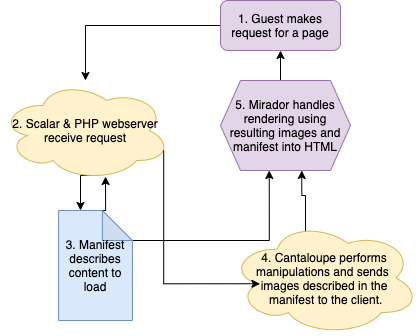

# System Components

The Digital Piranesi project uses several different components to deliver content.
The following is a description of each and its usage in the project, how it can
be accessed, and who to refer to regarding work with it.

## <span id="general_layout">General Layout</span>



*Note: Purple objects are client-side services, yellow are server-side services, and blue are static documents.*

1. The flow of data originates with a request made by a client browser for a specific artifact. This is identified at a unique URI (an ```id``` in IIIF terminology) on the server.  
2. The PHP web-server and [Scalar](#scalar) software receive the request and handle the loading of preliminary content and headers.
3. If the resource is an IIIF-described artifact, then the Manifest for this artifact is loaded, describing what additional resources the client ought to access.
4. The client requests images according to the Manifest document and the Cantaloupe image-server performs the necessary manipulations/adjustments to the image. A single, manipulated image results.
5. Mirador, a Javascript framework, handles the processing and rendering of the images from step 4, as well as any additional metadata/annotations provided by the Manifest. This HTML is then baked and rendered to the client.

## <span id="cantaloupe">Cantaloupe</span>

[Cantaloupe](https://cantaloupe-project.github.io/) is an IIIF compliant open-source image generator used to modify and manipulate images on-the-fly. It is written in Java and uses an HTTP API to communicate with clients.

The Digital Piranesi project uses Cantaloupe as the image-generation software for its archive and presentation of Piranesi's work. As seen in the [general layout flowchart](#general_layout)

## <span id="scalar">Scalar</span>

[Scalar](https://scalar.me/anvc/scalar/) is an open-source project that allows for the authoring and publishing of digital scholarship. Scalar offers an easy-to-use platform written in CSS, HTML, Javascript, and, predominately, PHP. All HTTP(s) requests, responses, and data-exchange between the browser and client is conducted via Scalar with the exception of [Cantaloupe](#cantaloupe) images.
